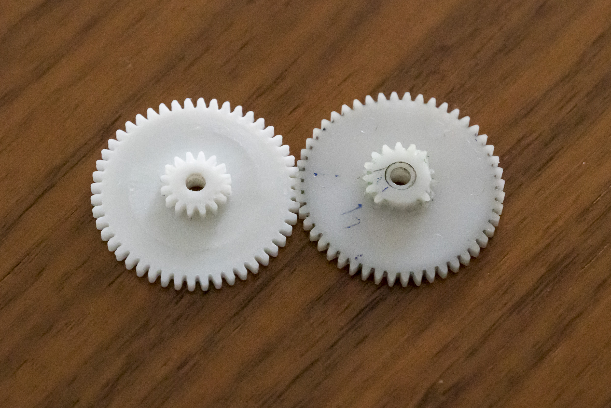

# Double gear 48/16 teeth (32/11 mm, hight 2x 2,5 mm)
3D printable gear for Cormoran Seacor 390 fishing reel. Created with Rhino 6.

Requirements:
* 3D printer 
* Filament of your choice

## View
 
 

